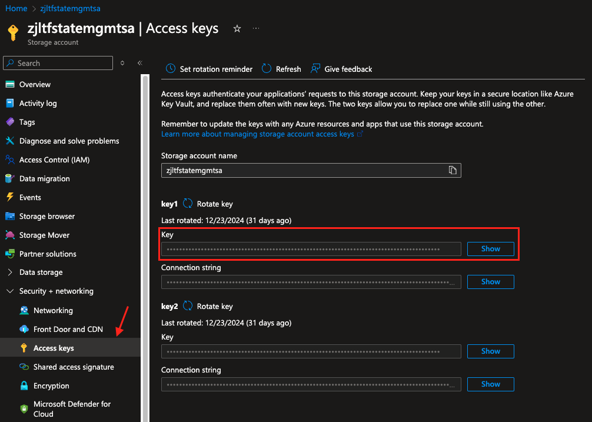

# Create Resource Group (Using Remote Backend)

Example Terraform project used to learn how to configure a remote storage backend for state management.

## Provider Configuration

```diff
terraform {
  required_providers {
    azurerm = {
      source  = "hashicorp/azurerm"
      version = "=4.1.0"
    }
  }

+ backend "azurerm" {}
}
```

## Backend Configuration

Terraform will look for and consume a `backend.conf` file. To configure an Azure Storage Account, below is an example from my project:

```
resource_group_name  = "tf-demo-rg"
storage_account_name = "zjltfstatemgmtsa"
container_name       = "tfstate"
access_key           = "<secret>"
```

The access_key can be obtained in the Azure Portal. Refer to the MSFT documentation found [here](https://learn.microsoft.com/en-us/azure/storage/common/storage-account-keys-manage?tabs=azure-portal#view-account-access-keys) for viewing account access keys.

