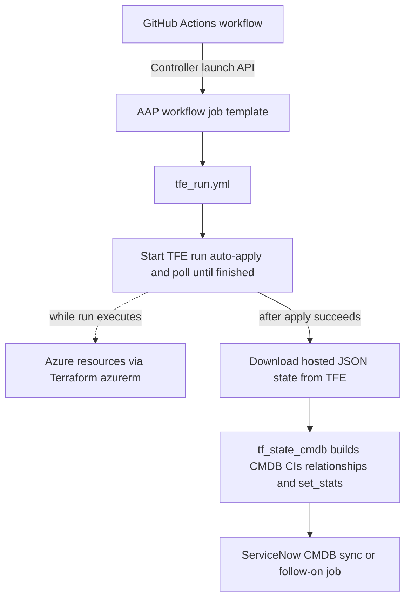
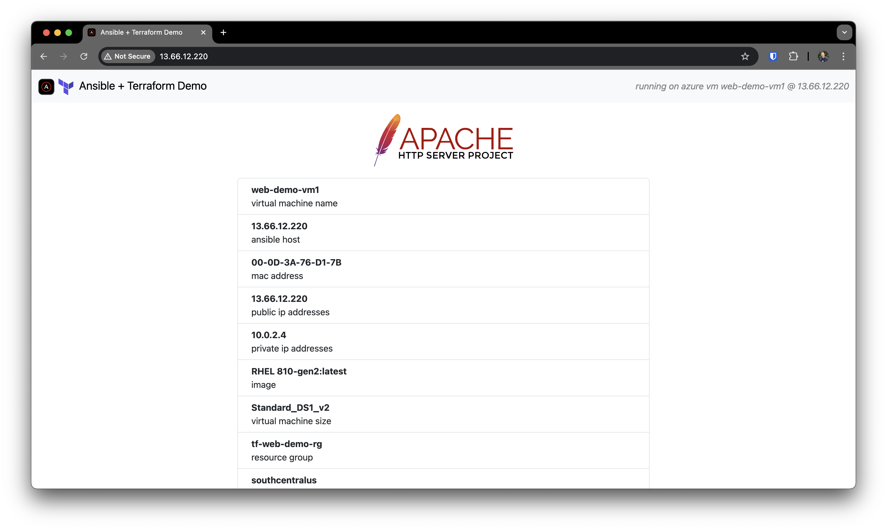

# Azure web demo: Terraform, Ansible, and ServiceNow CMDB

This folder is an end-to-end reference for **provisioning** Azure infrastructure with **Terraform** (via **Terraform Cloud / Enterprise**), **configuring** the resulting VMs with **Ansible**, and **reflecting Terraform state in the ServiceNow CMDB** as configuration items (CIs) with relationships. Optional workflow hooks show how Ansible Automation Platform can still **update ServiceNow tasks / request items** with job links when you supply ITSM context.

| Area | What to read |
| --- | --- |
| Infrastructure as code | [providers.tf](./providers.tf), [variables.tf](./variables.tf), [main.tf](./main.tf) |
| Run + state + CMDB | [ansible/tfe_run.yml](./ansible/tfe_run.yml), [ansible/roles/tf_state_cmdb/](./ansible/roles/tf_state_cmdb/) |
| Guest configuration | [ansible/configure_web.yml](./ansible/configure_web.yml) |
| GitHub → AAP trigger | [`.github/workflows/azure-create-web-demo-tfe-aap.yml`](../.github/workflows/azure-create-web-demo-tfe-aap.yml) |

---

## GitHub Actions integration

The repository workflow [azure-create-web-demo-tfe-aap.yml](../.github/workflows/azure-create-web-demo-tfe-aap.yml) **POSTs to the Ansible Automation Platform Controller API** and launches a **Workflow Job Template** so pushes (or manual runs) can start the same automation you would start from the UI.

- **When it runs**: on **push** to `master` when this folder or the workflow file changes, and on **`workflow_dispatch`** (manual; optional launch comment input).
- **What it sends**: `extra_vars` as a JSON string for the launch API, including **`aap_host`**, **`tfe_workspace_id`** (currently set in the workflow job env; align this with your workspace and with `tfe_workspace_id` / credentials used in AAP), and **GitHub run metadata** (`github_repository`, `github_ref`, `github_sha`, `github_workflow`, `github_run_url`, `github_actor`, and related fields) so playbooks or surveys can correlate an AAP run with the commit and Actions run.
- **Configure in GitHub**: repository **variables** `AAP_GATEWAY_URL` and `AAP_WORKFLOW_JOB_TEMPLATE_ID`, and secret **`AAP_OAUTH_TOKEN`** (Bearer token with permission to launch that workflow template). The step fails fast if `AAP_GATEWAY_URL` or `AAP_OAUTH_TOKEN` is missing.

Your AAP workflow should map **`tfe_workspace_id`** (and `TF_HOSTNAME` / `TF_TOKEN` from AAP credentials) into the job that runs **`tfe_run.yml`**, which today hardcodes `tfe_workspace_id` in playbook vars—override via extra_vars or survey if you wire the template to use the GitHub-supplied value.

---

## What this demonstrates

1. **Terraform** defines a small Azure footprint: resource group, VNet, subnet, NSG, two Linux VMs with public IPs, NICs, SSH key resource, and attached data disks.
2. **Ansible** drives a **Terraform Cloud / Enterprise** workspace run (`hashicorp.terraform.run`), then **downloads the current state JSON** and passes the `root_module.resources` list into a role that **builds CMDB payloads** (CIs + relationships) and exposes them via **`set_stats`** for a follow-on job (for example one that calls ServiceNow Table API or your `zjleblanc.servicenow.records`-style automation).
3. A separate playbook **configures** the VMs as web servers (packages, firewalld, templated home page) against an inventory group such as `tag_demo_web`.
4. **ServiceNow CMDB** alignment uses **correlation IDs** derived from Azure resource IDs so repeated runs can target the same logical CIs when your integration upserts by that key.



The **configure_web.yml** path (configure VMs, optional ITSM task or RITM stats) is usually another job in the same or a separate AAP workflow and is omitted here so the diagram stays focused on **GitHub → AAP → `tfe_run.yml` → TFE → state → ServiceNow CMDB mapping**.

---

## Terraform

### Resources

- Azure networking: resource group, VNet, subnet, NSG (SSH, HTTP, HTTPS), subnet–NSG association  
- Two **azurerm_linux_virtual_machine** instances with public IPs and NICs  
- **azurerm_ssh_public_key** and per-VM **azurerm_managed_disk** + **azurerm_virtual_machine_data_disk_attachment**

Image SKUs are set in [main.tf](./main.tf) (`source_image_reference`). To explore images:

```bash
az vm image list --publisher RedHat --all --output table
```

### Important variables

| Variable | Purpose |
| --- | --- |
| `az_resource_group`, `az_region` | Resource group name and Azure region |
| `web_tags_base` | Tags applied to resources (also mapped into CMDB fields such as cost center, owner, environment where present) |
| `web_*` | Naming and sizing for NICs, VMs, VNet, subnet, NSG, admin user, SSH key |
| `az_client_id`, `az_client_secret`, `az_tenant_id`, `az_subscription_id` | Azure provider credentials |
| `aap_job_url`, `aap_workflow_url` | Injected on each run from Ansible for traceability in Terraform variables / outputs ([outputs.tf](./outputs.tf)) |
| `sc_task` | Reserved for broader demos (optional catalog task number); not required for CMDB mapping in this folder |

Backend and `terraform { cloud { ... } }` organization/workspace are configured in your environment or VCS-driven workspace, not hard-coded here.

---

## Ansible playbooks

| Playbook | Purpose |
| --- | --- |
| [ansible/tfe_run.yml](./ansible/tfe_run.yml) | Start an auto-apply run in a TFE workspace, wait for completion, resolve the **current state version**, download **hosted JSON state** to disk, then run **`tf_state_cmdb`** so CMDB-oriented facts are computed and published with **`set_stats`**. |
| [ansible/configure_web.yml](./ansible/configure_web.yml) | Target hosts (for example **`tag_demo_web`** from Azure dynamic inventory), install and enable **httpd**, open **80/tcp** in firewalld, deploy **index.html** from [ansible/templates/index.html.j2](./ansible/templates/index.html.j2), and optionally set **stats** for ServiceNow **sc_task** / **RITM** updates. |

### `tfe_run.yml` expectations

- **Environment**: `TF_HOSTNAME` (TFE / Terraform Cloud API host) and `TF_TOKEN` for API calls after the run module completes.  
- **Workspace**: `tfe_workspace_id` is set in the playbook vars (replace with your workspace ID).  
- **Terraform variables on the run**: `aap_workflow_url` and `aap_job_url` are passed into the workspace so they are stored with the run and available as Terraform variables / outputs for auditing.

The playbook reads `values.root_module.resources` from the downloaded state file and sets `tf_state_resources` when including `tf_state_cmdb`.

### `configure_web.yml` expectations

- Inventory must include the web VMs (this demo assumes a host pattern like **`tag_demo_web`** and facts such as `computer_name`, `public_ip_address`, and image fields used in [ansible/vars/main.yml](./ansible/vars/main.yml) for the template).  
- **`become: true`** on the web hosts for package and service tasks.

---

## Mapping Terraform state to ServiceNow CMDB

Role: **`tf_state_cmdb`** ([ansible/roles/tf_state_cmdb/](./ansible/roles/tf_state_cmdb/)).

### Input

- **`tf_state_resources`**: list of resource blocks from Terraform state JSON, typically:

  `(state['values']['root_module']['resources'] | default([]))`

  as wired in [ansible/tfe_run.yml](./ansible/tfe_run.yml).

The role filters by Terraform resource **type** in [ansible/roles/tf_state_cmdb/vars/main.yml](./ansible/roles/tf_state_cmdb/vars/main.yml): resource groups, VNets, subnets, Linux VMs, NICs, managed disks, and data disk attachments.

### Configuration items built

| ServiceNow class | Source (Terraform type) | Notes |
| --- | --- | --- |
| `cmdb_ci_azure_datacenter` | Derived unique **locations** from resource groups and VNets | Synthetic “datacenter” per Azure region; `correlation_id` like `azure/<region>` |
| `cmdb_ci_vpc` | `azurerm_virtual_network` | `correlation_id` = Azure VNet id |
| `cmdb_ci_subnet` | `azurerm_subnet` | Location / tag metadata inherited from parent VNet match |
| `cmdb_ci_vm_instance` | `azurerm_linux_virtual_machine` | OS, disk space, public IP, location, tags |
| `cmdb_ci_nic` | `azurerm_network_interface` | Private IP, MAC, location, tags |
| `cmdb_ci_storage_volume` | `azurerm_managed_disk` | Size in bytes, location, tags |

`correlation_display` is set to **`aap.terraform.io`** on these CIs so you can identify the integration source in ServiceNow.

### Relationships built

Relationships use the same **correlation_id** style identifiers as the parent/child CIs (Azure resource IDs where applicable, except datacenter child keys use `azure/<region>`).

| Relationship type | Parent | Child |
| --- | --- | --- |
| **Located in::Houses** | VNet (`cmdb_ci_vpc`) | Azure datacenter CI for that region |
| **Located in::Houses** | Subnet (`cmdb_ci_subnet`) | Parent VNet |
| **Provides storage for::Stored on** | Managed disk (`cmdb_ci_storage_volume`) | VM (`cmdb_ci_vm_instance`) via attachment |
| **IP Connection::IP Connection** | VM | NIC |
| **Connects to::Connected by** | NIC | Subnet (from NIC IP configuration `subnet_id`) |

### Output for downstream automation

[ansible/roles/tf_state_cmdb/tasks/main.yml](./ansible/roles/tf_state_cmdb/tasks/main.yml) ends with:

| Stat key | Content |
| --- | --- |
| **`sn_manage_resources`** | List of CI payloads; each item has `name`, `sys_class_name`, and `other` (field bag for your Table API upsert or record role) |
| **`sn_manage_relationships`** | List of relationship payloads (`parent`, `parent_type`, `child`, `child_type`, `type`) |

A workflow job can consume these stats and call your ServiceNow modules or **`zjleblanc.servicenow.records`** (or equivalent) to create or update rows and relationship records idempotently.

---

## Optional ServiceNow ITSM (tasks and request items)

The **CMDB** path above does not require catalog variables. Separately, [ansible/configure_web.yml](./ansible/configure_web.yml) can emit **stats** for classic **task / RITM** updates when you define:

| Variable | Purpose |
| --- | --- |
| `sc_task_created` | Per-host dict with `sys_id` (and related fields) for **sc_task** rows to close with work notes |
| `create_sc_task_data` | Used by the second play; should include **`request_item_sys_id`** for the RITM update |
| `aap_host`, `awx_workflow_job_id`, `awx_job_id` | Build links to AAP workflow and job output in work notes |

When those are defined, stats such as **`update_sc_task_sys_id`**, **`update_sc_task_data_overrides`**, **`update_ritm_sys_id`**, and **`update_ritm_data_overrides`** are set for a downstream ITSM job to apply.

---

## Outcome (configured web servers)

Ansible templates a simple landing page per VM. Example from a prior run:



---

## Operational notes and lessons learned

**Terraform Cloud / Enterprise**

- Workspace runs are triggered from Ansible with **`hashicorp.terraform.run`**; polling and timeouts are set in [ansible/tfe_run.yml](./ansible/tfe_run.yml).  
- State is fetched with the **state version** API and the **hosted JSON state download URL** (Bearer token same as `TF_TOKEN`).

**Azure authentication**

- The **azurerm** provider in [providers.tf](./providers.tf) uses **`var.az_*`** credentials. In AAP, **ARM_*** vs **AZURE_*** style credential injectors may differ; map or template variables so Terraform receives the names it expects.  
- Remote state / backend auth (for example storage account key) is separate from provider auth; **`TF_BACKEND_CONFIG_FILE`** or custom credential types are common for backends.

**Inventory**

- CMDB mapping runs on **localhost** with state JSON only. **configure_web.yml** needs a live inventory (dynamic Azure inventory with the same tags Terraform applies is the typical pattern).

**ServiceNow tables and fields**

- CMDB classes and relationship types in the role match common ServiceNow patterns; validate against your instance (custom classes or relationship types may require small role adjustments).
