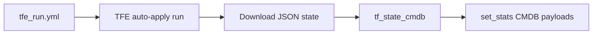

# Ansible automation (`azure_create_web_demo_tfe_aap`)

This directory holds the **Ansible Automation Platform** playbooks, templates, and roles used with the parent Terraform workspace. Together they:

1. **Drive Terraform Cloud / Enterprise** — start an auto-apply run, wait for completion, download hosted JSON state.
2. **Map Terraform state to ServiceNow CMDB** — build configuration item and relationship payloads and publish them with `set_stats`.
3. **Configure the web VMs** — install Apache, open HTTP in firewalld, and deploy a demo landing page.

End-to-end context (Terraform resources, GitHub Actions → AAP launch, and CMDB class tables) lives in the [parent README](../README.md).

---

## Layout

| Path | Purpose |
| --- | --- |
| [tfe_run.yml](./tfe_run.yml) | Localhost playbook: TFE run + state download + `tf_state_cmdb` role |
| [configure_web.yml](./configure_web.yml) | Web server configuration on inventory hosts (e.g. `tag_demo_web`) |
| [vars/main.yml](./vars/main.yml) | Facts used by the web page template (`info_list_kvpairs`) |
| [templates/index.html.j2](./templates/index.html.j2) | Bootstrap demo page deployed to `/var/www/html/index.html` |
| [roles/tf_state_cmdb/](./roles/tf_state_cmdb/) | Role: Terraform state → ServiceNow CMDB structures |
| [filter_plugins](./filter_plugins) | Symlink to repo-root custom filters (shared with other demos) |

---

## Playbooks

### `tfe_run.yml` — Terraform run and CMDB mapping

Runs on **`localhost`** with `gather_facts: false`.

| Step | What it does |
| --- | --- |
| Create run | `hashicorp.terraform.run` — auto-apply workspace run with `poll` (15s interval, 3600s timeout) |
| Workspace info | `hashicorp.terraform.workspace_info` — resolve current state version |
| Download state | `ansible.builtin.uri` — fetch hosted JSON state using `TF_HOSTNAME` and `TF_TOKEN` |
| Map to CMDB | `include_role: tf_state_cmdb` — pass full state JSON; role derives `tf_state_resources` |

**Inputs you must supply in AAP (or extra_vars):**

| Variable / env | Purpose |
| --- | --- |
| `tfe_workspace_id` | Target workspace (hardcoded in playbook vars today; override via survey/extra_vars) |
| `TF_HOSTNAME`, `TF_TOKEN` | TFE API host and bearer token for state download |
| `aap_host`, `awx_workflow_job_id`, `awx_job_id` | Passed into Terraform as `aap_workflow_url` / `aap_job_url` for traceability |

**Outputs for downstream jobs:** the `tf_state_cmdb` role publishes job stats:

- `sn_manage_resources` — CI payloads (`name`, `sys_class_name`, `other`)
- `sn_manage_relationships` — relationship rows (`parent`, `parent_type`, `type`, `child`, `child_type`)

A follow-on workflow job can consume these stats and upsert into ServiceNow (Table API, collection modules, etc.).

### `configure_web.yml` — Guest configuration and optional ITSM stats

**Play 1 — Configure web server** (`hosts: tag_demo_web`, `become: true`)

| Task | Module / action |
| --- | --- |
| Install httpd | `ansible.builtin.package` (RHEL: `ansible_python_interpreter: /usr/libexec/platform-python`) |
| Enable service | `ansible.builtin.service` |
| Open port 80 | `ansible.posix.firewalld` |
| Deploy page | `ansible.builtin.template` → `index.html.j2` |
| Task stats (optional) | `set_stats` for ServiceNow **sc_task** close when `sc_task_created` is defined |

**Play 2 — Request item update** (runs on `localhost` only when `create_sc_task_data` is defined)

Emits `set_stats` for **RITM** (`update_ritm_sys_id`, `update_ritm_data_overrides`) with workflow links and close notes.

**Inventory expectations:** dynamic Azure inventory (or static) with hosts tagged for this demo, plus facts such as `public_ipv4_address`, `mac_address`, `image`, `virtual_machine_size`, `resource_group`, and `location` for [vars/main.yml](./vars/main.yml).

---

## Role: `tf_state_cmdb`

Maps Azure resources from Terraform state into ServiceNow-oriented CMDB data.

**Caller options:**

- Pass **`tf_state_json`** (full state dict) — role walks `values.root_module` and optional `child_modules` (`tf_state_cmdb_flatten_child_modules`, default `true`).
- Or pass **`tf_state_resources`** directly (list of `root_module.resources` objects).

**Terraform types handled (defaults):**

| CI maps (`files/ci_maps/`) | Relationship maps |
| --- | --- |
| `azurerm_resource_group`, `azurerm_virtual_network`, `azurerm_subnet` | VNet → datacenter, subnet → VNet, NIC → subnet, disk attachment → VM |
| `azurerm_linux_virtual_machine`, `azurerm_network_interface`, `azurerm_managed_disk` | VM → NIC (subelement map on `network_interface_ids`) |

Correlation IDs use Azure resource IDs (and synthetic `azure/<region>` datacenter keys) so repeated runs can upsert the same logical CIs.

Detailed role design, map file formats, JMESPath subelement relationships, and extension steps: **[roles/tf_state_cmdb/README.md](./roles/tf_state_cmdb/README.md)**.

---

## Web template

[templates/index.html.j2](./templates/index.html.j2) renders a Bootstrap page with:

- Subtitle from the playbook (`inventory_hostname`, public IP)
- VM metadata from `info_list_kvpairs` in [vars/main.yml](./vars/main.yml)
- Branding for Ansible + Terraform + Azure

---

## Typical AAP workflow

| Job order | Playbook | Hosts |
| --- | --- | --- |
| 1 | `tfe_run.yml` | `localhost` |
| 2 | (optional) ServiceNow sync job | consumes `sn_manage_*` stats from job 1 |
| 3 | `configure_web.yml` | `tag_demo_web` (+ optional ITSM job from stats) |

GitHub Actions can launch the same workflow via the repository workflow documented in the [parent README](../README.md#github-actions-integration).

---

## Quick reference: required collections

| Collection | Used by |
| --- | --- |
| `hashicorp.terraform` | `tfe_run.yml` (`run`, `workspace_info`) |
| `ansible.posix` | `configure_web.yml` (`firewalld`) |
| `ansible.builtin` | Core modules throughout |

Ensure these are in your execution environment or `requirements.yml` for the AAP project.
